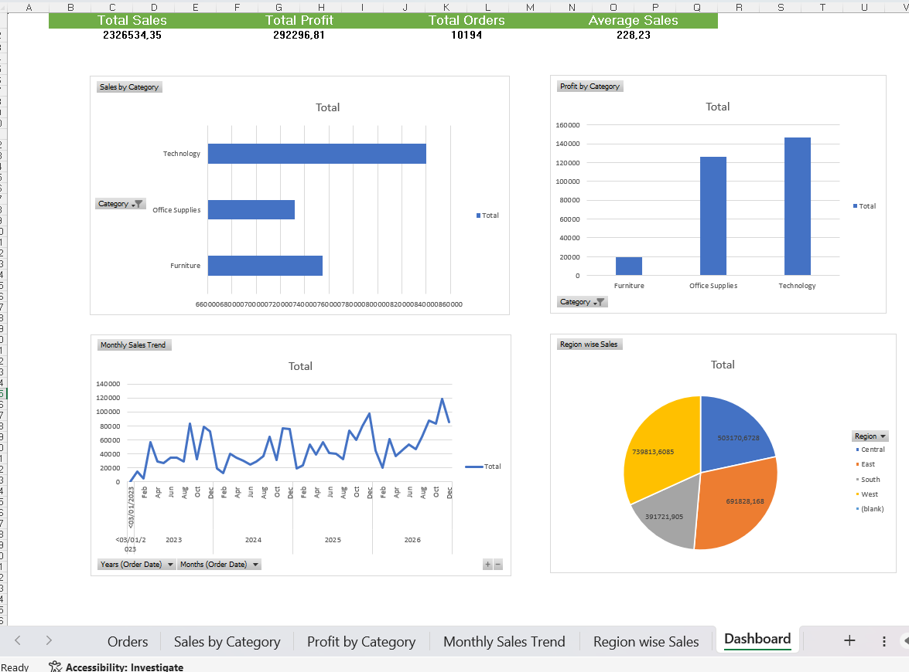

#  Data Analyst Internship - Task 01

## Sales Dashboard Analysis

###  Project Overview

This project focuses on analyzing sales data and creating an interactive dashboard using Microsoft Excel. The dashboard helps visualize key Zbusiness metrics such as sales, profit, and regional performance.

**Tools Used**

- Microsoft Excel
- Pivot Tables
- Pivot Charts
- Slicers
- Data Visualization

**Dataset**

The project uses the Sample Superstore dataset to analyze sales performance across different regions, categories, and customer segments.

**Dashboard Features**

- Total Sales Analysis
- Profit Analysis
- Regional Performance
- Category-wise Sales Comparison
- Interactive Filters and Slicers

**Dashboard Preview**

**Key Insights**

- Identified top-performing regions.
- Compared sales and profit across categories.
- Analyzed customer purchasing trends.
- Created an interactive dashboard for better decision-making.

**Project Files**

- `Sales_Dashboard.xlsx` – Interactive Excel Dashboard
- `Sales_Dashboard.png` – Dashboard Screenshot
- `sample_superstore.xls` – Source Dataset

**Learning Outcomes**

Through this project, I learned:
- Data Cleaning and Preparation
- Data Analysis using Excel
- Dashboard Design
- Data Visualization Techniques
- Business Insight Generation

**Author**

  Nowfi Fathima A

**GitHub Repository**

https://github.com/nowfifathima/SCT_DA_1.git
